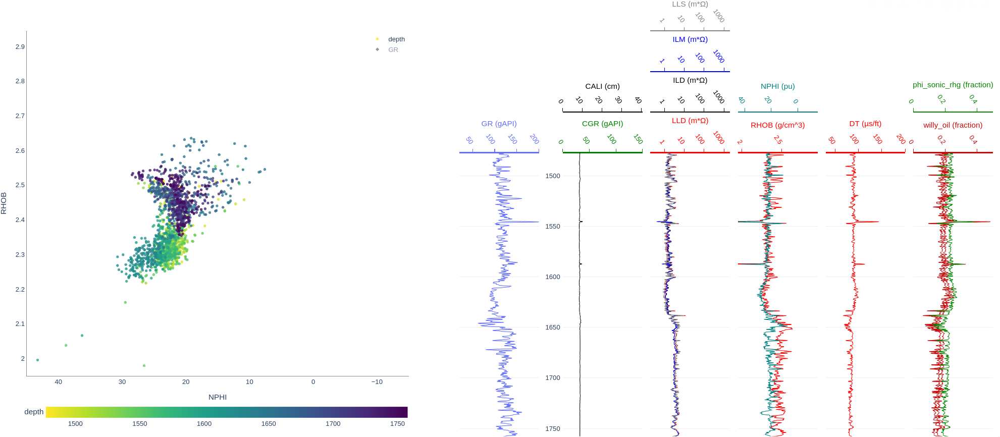

# Crossplots

Tracks are plotted by creating and manipulating a `pozo.Graph` object (maybe call it `my_graph`), and then calling `my_graph.render()`.


However, graph objects can also plot **crossplots**, like this one of density and porosity:


### Step 1: Create a crossplot renderer:
```python
my_graph.CrossPlot(
	x = graph1.get_data(pozo.HasLog("NPHI")),
	y = graph1.get_data(pozo.HasLog("RHOB")),
	colors = ["depth", graph1.get_track(pozo.HasLog("GR"))],
	xrange=(45, -15),
	yrange=(1.95, 2.945),
	size=800,
	depth_range=(1100, 1300),
)

# x: pozo object containing x axis data
# y: pozo object contain y axis data
# colors: list of pozo objects to create traces with color mapping. can include "depth" or be None for no colors.
# xrange, yrange: set x and y ranges
# size: set size of graph
# depth_range: filter graph by certain depths
```

### Step 2 option 1:
The renderer can be saved to a variable and also accessed at `my_graph.xp`.

```python
my_graph.xp.render() # this will render like a graph above
```

### Step 2 option 2:

You can also link the crossplot to a regular track graph. This is great because you can easily change the range of depth you are viewing with the crossplot by changing the depth range of the track graph.

```python
my_graph.render(xp=True) # this will add the default crossplot that you created with `my_graph.CrossPlot()`
```



You could also add a different crossplot if you have a renderer for it:

```python
my_graph.render(xp=some_other_cross_plot_renderer)
```


## Controlling the Interactive Graphs

First, `pozo` always generates `plotly.FigureWidget` objects, which are plotly graphs. All of the plotly API for adding traces, annotations, making changes, are available. You can access the `plotly.FigureWidget` object like this:

1) Saving it in a variable after calling `render()` (render returns a figure object)
2) Accessing the last figure generated:

```python
my_graph.last_fig

my_graph.xp.last_fig
```
Those will be `None` if you never rendered them.


### A note about colormaps:

To show the z-axis, we use colormaps in our crossplots. Plotly will automatically choose the optimal color range: one to show you all the data in the highest resolution. The colormap functions like a "color zoom".


#### *Examples of bad configurations:*

##### Too zoomed in:

Data goes between 1-10. Your color map goes between 4-5. You can't see all the data, it's useless.

##### Too zoomed out:

Data goes between 1-10. Your color map goes between -10000 and 10000. You are too zoomed out, all points will be the same color.

Everytime you update the graph, either by changing the depth range or modifying it, plotly find's the optimal colormap for your data. This isn't always useful when we want to change things without changing the colormap, since we're trying to compare several graphs or perspectives and want them to share the same colormap. See the functions below to control this behavior:

